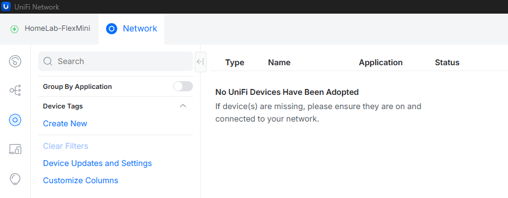
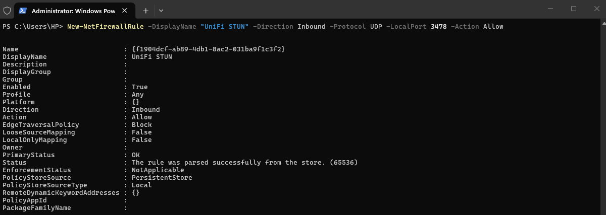
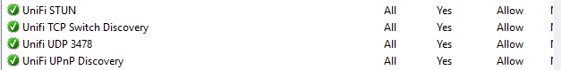
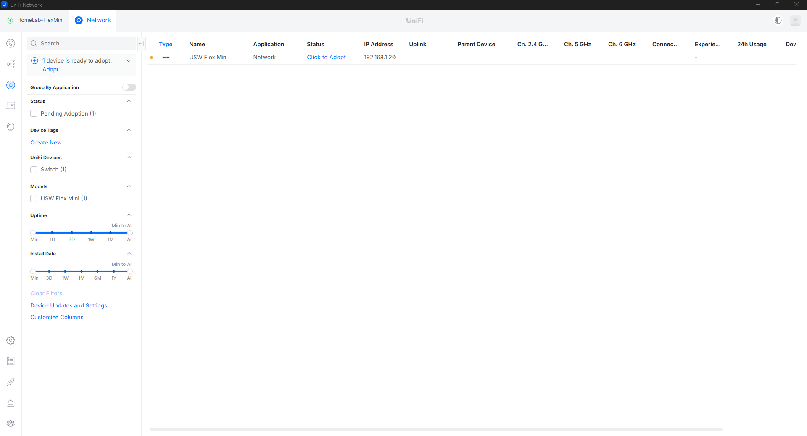

<p align="center">  
	
</p>

# UniFi OS Server – 🛠️ Troubleshooting

This is where things stopped being “follow the guide” and started becoming real troubleshooting.

I ran into a few issues getting my switch to show up—and honestly, this ended up being the most valuable part of the whole lab.

---

## When No Devices Show Up

At one point, my UniFi dashboard just looked like this:



No devices. Nothing to adopt.

At first, I thought I messed something up in the setup… but it turned out to be something much simpler (and sneakier).

---

## The Fix (Windows Firewall)

The issue ended up being **Windows Defender Firewall** blocking the discovery traffic.

To fix it, I ran the following commands in **PowerShell (as Administrator)**:

```powershell id="j1h0zt"
# Allow UDP 1900 (UPnP - discovery)
New-NetFirewallRule -DisplayName "UniFi UPnP Discovery" -Direction Inbound -Protocol UDP -LocalPort 1900 -Action Allow

# Allow UDP 10001 (Ubiquiti Discovery)
New-NetFirewallRule -DisplayName "UniFi Discovery Protocol" -Direction Inbound -Protocol UDP -LocalPort 10001 -Action Allow

# Allow TCP 8080 (Device communication)
New-NetFirewallRule -DisplayName "UniFi Device Communication" -Direction Inbound -Protocol TCP -LocalPort 8080 -Action Allow

# Allow UDP 3478 (STUN)
New-NetFirewallRule -DisplayName "UniFi STUN" -Direction Inbound -Protocol UDP -LocalPort 3478 -Action Allow
```

After adding these rules:



And confirming them in the firewall settings:



I refreshed the UniFi dashboard…

---

## And There It Was



The switch finally showed up.

That moment felt small—but it actually meant everything was working correctly underneath.

---

## What Actually Happened

Here’s what I realized after digging into it:

* My switch **was powered on and ready**
* My IP configuration **was correct**
* But the firewall was quietly blocking the **broadcast/multicast discovery traffic**

So the device wasn’t “missing”—it just couldn’t announce itself to the controller.

---

## How I Figured It Out

I didn’t guess the answer—I worked through it step by step:

* Checked the physical layer → LED was steady white ✅
* Tried pinging → no response (normal for this device) ✅
* Disabled the firewall temporarily → device appeared instantly ✅

That last step confirmed it.

---

## The Important Lesson

It would’ve been easy to just leave the firewall turned off and move on.

But that’s not how real environments work.

So instead, I:

* Re-enabled the firewall
* Added only the **specific ports needed**
* Verified everything still worked

---

## Takeaway

This part of the lab taught me more than the installation did.

Not everything breaks loudly—sometimes things fail quietly:

* No errors
* No warnings
* Just… nothing showing up

And that’s where troubleshooting actually begins.

---

If you’ve made it this far in your own setup and nothing is showing up—check your firewall first. It might save you a lot of time.
